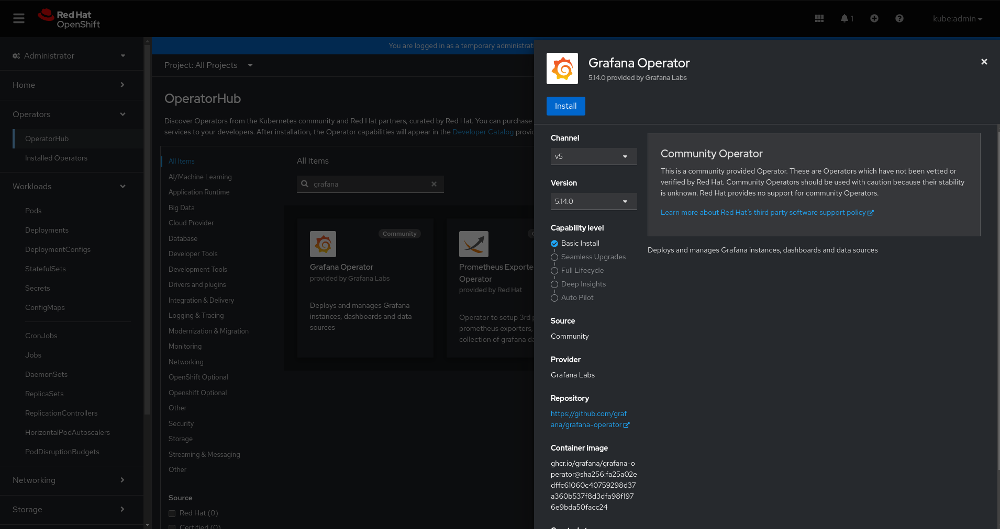
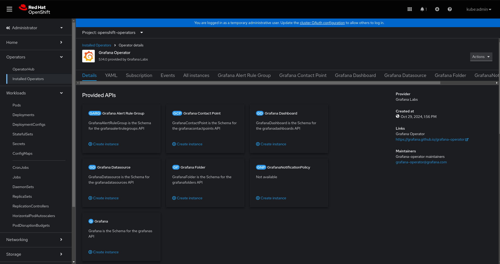
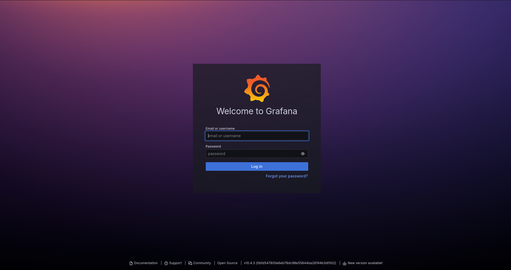
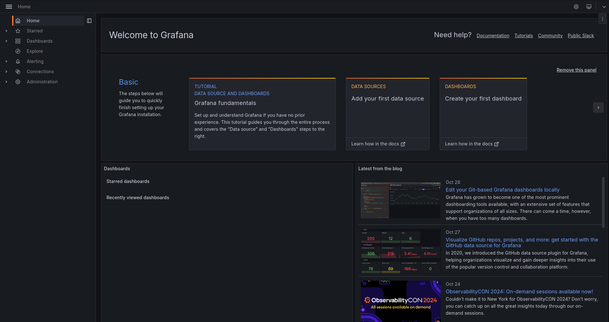
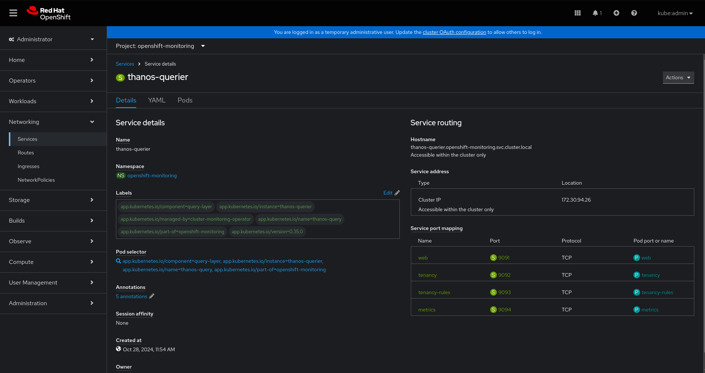
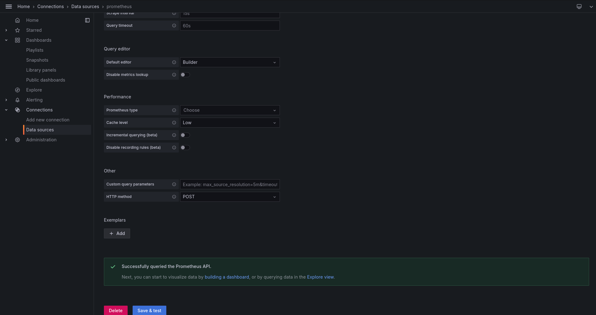
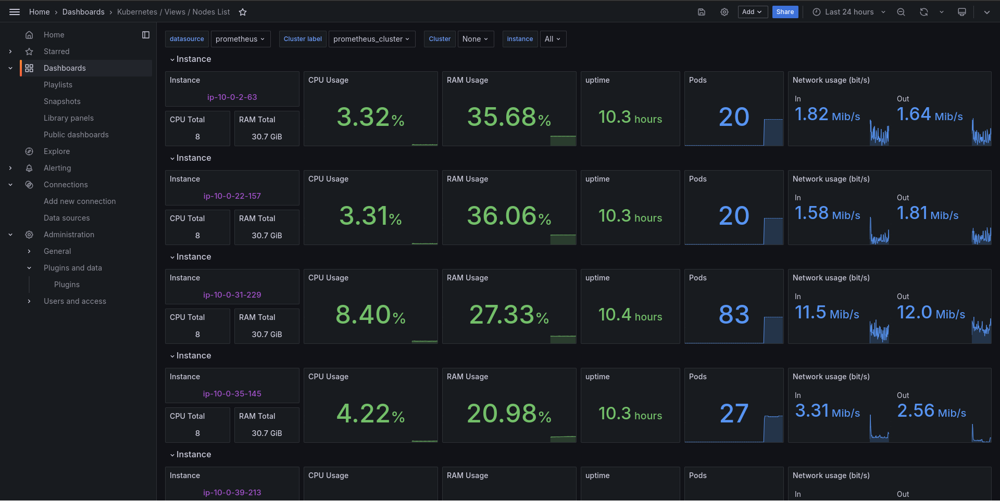

# Red Hat OpenShift Monitoring Cluster Resources

This repository was created out of the need to **monitor resources in Red Hat OpenShift clusters** in a customized way.

Monitoring OpenShift cluster resources using Grafana is essential to ensure the environment's performance, stability, and operational efficiency.

This practice offers several benefits:

* **Real-time visibility:** Grafana provides an intuitive visual interface that allows for real-time cluster metrics monitoring.
* **Problem detection and resolution:** Continuous monitoring helps identify potential issues before they impact services.
* **Enhanced operational efficiency:** Detailed monitoring allows for optimized resource usage.
* **Support for data-driven decision-making:** With Grafana, decisions on scalability and resource allocation can be made based on real data and accurate metrics.


## Lab - How to implement observability dashboards in Red Hat OpenShift clusters

Before starting the lab, it is necessary to ensure that a user with the required permissions is logged into Red Hat OpenShift (console and cli).

Let's create a service account so that Grafana can securely access resources (e.g., Prometheus) in the openshift-monitoring namespace.
```bash
oc create serviceaccount grafana-sa -n openshift-monitoring
```

Let's assign a policy with monitoring permissions to the Grafana service account. It assigns the cluster-monitoring-view cluster role to a user or service account, giving it read-only access to the monitoring stack in OpenShift, including Prometheus metrics and monitoring configurations.

```bash
oc adm policy add-cluster-role-to-user cluster-monitoring-view -z grafana-sa
```

As access to Prometheus in Red Hat OpenShift is done through an authenticated URL, it is necessary to create a token from the Grafana service account.

```bash
oc create token grafana-sa --duration=8760h -n openshift-monitoring
```
The *--duration=8760h* option specifies that this token should be valid for **one year**.

==**Important:** Save this token, as it will be needed later.==


#### Deploying Grafana

>**[Grafana](https://grafana.com/)** is an open-source analytics and monitoring platform that allows users to visualize and analyze data from multiple sources, such as Prometheus, InfluxDB, Elasticsearch, and others, in real-time. It offers an intuitive interface to create custom dashboards with graphs, charts, and alerts, making it easy to monitor infrastructure, application performance, and business metrics. Grafana supports flexible data queries, customizable visualizations, and integrations with various tools, making it a popular choice for organizations looking to centralize observability and gain insights from their data.

In the Red Hat OpenShift management console, navigate to the side menu **Operators** > **OperatorHub** and search for *Grafana Operator*. After finding it, <u>click the Install button</u>.



You can keep the default settings for the presented form. After completing the operator installation, the details screen is displayed.



Let’s create the Grafana resource in Red Hat OpenShift. In the Grafana tab, <u>click the Create Grafana button</u>, and in the YAML view option, replace the loaded content with our [grafana.yaml](custom-resources/grafana/grafana.yaml) file. After that, <u>click the Create button</u>.

With the Grafana resource installed, the Deployment and Service resources will be created automatically for us. Just check if the grafana pods are in the Ready state.

It is necessary to export the route for the service:

```bash
oc expose service grafana-service -n openshift-monitoring
```

When accessing the route, you must log in for the first time using the **username and password defined in the Grafana resource YAML**. Immediately afterward, you will be prompted to set a new password.



At this point, the Grafana home screen will be displayed.



Navigate to the side menu **Connections** > **Data sources**. <u>Click the Add data source button</u> and select the **Prometheus type**.

> **[Prometheus](https://prometheus.io/)** is an open-source monitoring and alerting toolkit designed to collect and store metrics as time-series data, making it ideal for monitoring applications, infrastructure, and services. It scrapes data from endpoints at specified intervals, stores it locally, and provides a powerful query language (PromQL) to analyze and visualize metrics. Widely used in cloud-native environments, Prometheus integrates well with container orchestration systems like Kubernetes, enabling real-time insights and alerting on resource usage, application performance, and system health.

We will fill out the form with the necessary information to establish the connection with Red Hat OpenShift's Prometheus.

| Form                                 |    Value     |
| ----------------                 | ------- |
| Prometheus server URL            | *https://<**thanos-querier-service-hostname**>:9091*    |
| Authentication methods           | *No Authentication*     |
| Skip TLS certificate validation  | *Checked*    |
| HTTP Headers                     | *Authorization : Bearer + service account token*    |

To find the Thanos Querier hostname, go to the openshift-monitoring project, navigate to the side menu **Networking** > **Services**, and locate the thanos-querier service.



>**[Thanos Querier](https://thanos.io/)** is a component of the Thanos system that provides a unified query endpoint for metrics from multiple Prometheus instances, enabling centralized access to both real-time and historical data across clusters. It simplifies monitoring in distributed environments by aggregating metrics, making large-scale observability more accessible and scalable.

After filling out the form with the required information, <u>click on the Save & test button</u> and the connection should have been successfully established.



In the side menu, navigate to **Dashboards** and then <u>click on the Create Dashboard button</u>. We’ll choose the option to import a dashboard.

In the *Import via dashboard JSON model field*, enter the content of the JSON file for the selected dashboard from [grafana folder](custom-resources/grafana/) and <u>click the Load button</u>.

A second screen will open where you can change the name of the dashboard and select the data source. To finish, simply <u>click the Import button</u>.

The dashboard is expected to load successfully, reading metrics from Red Hat OpenShift via Prometheus.

Below are examples of the dashboards in operation.


