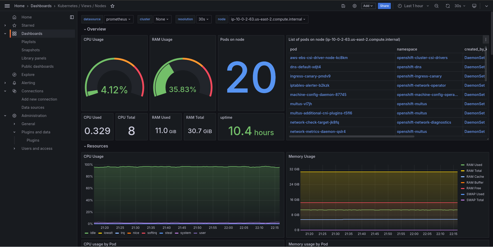

# Red Hat OpenShift Monitoring Cluster Resources

This repository was created out of the need to **monitor resources in Red Hat OpenShift clusters** in a customized way.

Monitoring OpenShift cluster resources using Grafana is essential to ensure the environment's performance, stability, and operational efficiency.

This practice offers several benefits:

* **Real-time visibility:** Grafana provides an intuitive visual interface that allows for real-time cluster metrics monitoring.
* **Problem detection and resolution:** Continuous monitoring helps identify potential issues before they impact services.
* **Enhanced operational efficiency:** Detailed monitoring allows for optimized resource usage.
* **Support for data-driven decision-making:** With Grafana, decisions on scalability and resource allocation can be made based on real data and accurate metrics.


## Lab - How to implement observability dashboards in Red Hat OpenShift clusters


```bash
oc create serviceaccount grafana-sa -n openshift-monitoring
```


```bash
oc adm policy add-cluster-role-to-user cluster-monitoring-view -z grafana-sa
```


```bash
oc create token grafana-sa --duration=8760h -n openshift-monitoring
```
>>Save this token, as it will be needed later.


#### Deploying Grafana

[Explicação sobre o que é o Grafana]


You can keep the default settings for the presented form.


Let’s create the Grafana resource in Red Hat OpenShift. In the Grafana tab, click the Create Grafana button, and in the YAML view option, replace the loaded content with our [grafana.yaml](custom-resources/grafana/grafana.yaml) file. After that, click the Create button.

With the Grafana resource installed, the Deployment and Service resources will be created automatically for us. Just check if the grafana pods are in the Ready state.

It is necessary to export the route for the service:

```bash
oc expose service grafana-service -n openshift-monitoring
```

When accessing the route, you must log in for the first time using the username and password defined in the Grafana resource YAML. Immediately afterward, you will be prompted to set a new password.


At this point, the Grafana home screen will be displayed.


Go to the side menu and *click on **Connections** > **Data sources***. Click on the Add data source button and select the Prometheus type.

We will fill out the form with the necessary information to establish the connection with Red Hat OpenShift's Prometheus.

* Name
* Prometheus server URL
* Authentication methods
* Skip TLS certificate validation
* HTTP Headers
* Click on the Save & test button

Para encontrar o host do thanos querier, execute o seguinte comando:

```bash
oc expose service grafana-service -n openshift-monitoring
```

The connection should have been successfully established.


In the side menu, click on **Dashboards** and then on the Create Dashboard button. We’ll choose the option to import a dashboard.

In the Import via dashboard JSON model field, enter the content of the JSON file for the selected dashboard from [grafana folder](custom-resources/grafana/) and click the Load button.

A second screen will open where you can change the name of the dashboard and select the data source. To finish, simply click the Import button.

The dashboard is expected to load successfully, reading metrics from Red Hat OpenShift via Prometheus.

Below are examples of the dashboards in operation.




